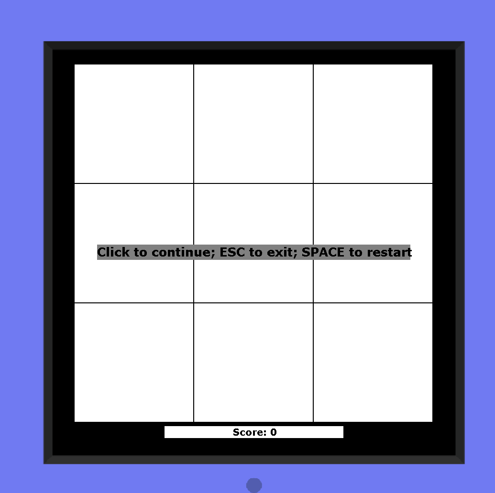
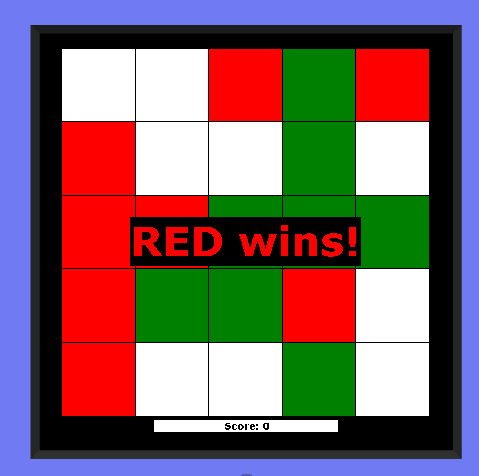

#### Game implemented on engine JavaRush game-engine;





* #### Color of cell used as mark player and AI (Player - GREEN, AI - RED, empty field - WHITE)
* #### Game can show win and draw situation 
* #### AI will try win or prevent Player

```java
public class TicTacToe extends Game {

    private final static int SIZE = 5;
    private final static int COUNT_TO_WIN = 4;

    private final Color PLAYER_MARK = Color.GREEN;
    private final Color AI_MARK = Color.RED;
    private final Color EMPTY = Color.WHITE;

    private int numbersOfTurns = 0; // if == SIZE*SIZE = nobody win
    private boolean gameOn = true;  // if false - game stop

    //region Main Game  Player and AI

    // Player always start game
    @Override
    public void onMouseLeftClick(int x, int y) {

        if (gameOn && allowToPick(x, y)) {
            setCellColor(x, y, PLAYER_MARK);
            numbersOfTurns++;
            if (checkWin(x, y, PLAYER_MARK, COUNT_TO_WIN)) showWinner(PLAYER_MARK);
            if (gameOn) checkNobodyWon();
            if (gameOn) aiTurn();
            if (gameOn) checkNobodyWon();
        }
    }

    private void aiTurn() {
        boolean aiNeedToDoTurn = true;
        // if AI can win - will do it
        for (int x = 0; x < SIZE; x++) {
            for (int y = 0; y < SIZE; y++) {
                if (allowToPick(x, y)) {
                    if (checkWin(x, y, AI_MARK, COUNT_TO_WIN)) {
                        setCellColor(x, y, AI_MARK);
                        numbersOfTurns++;
                        aiNeedToDoTurn = false;
                        if (checkWin(x, y, AI_MARK, COUNT_TO_WIN)) showWinner(AI_MARK);
                        break;
                    }
                }
            }
        }
        // if Player can win - will try to stop him
        if (aiNeedToDoTurn)
            // AI will lock for worst situation (player win)
            // and further will prevent calculating player marks
            for (int i = COUNT_TO_WIN; i > 1; i--) {
                for (int x = 0; aiNeedToDoTurn && x < SIZE; x++) {
                    for (int y = 0; y < SIZE; y++) {
                        if (allowToPick(x, y)) {
                            if (checkWin(x, y, PLAYER_MARK, i)) {
                                setCellColor(x, y, AI_MARK);
                                numbersOfTurns++;
                                aiNeedToDoTurn = false;
                                break;
                            }
                        }
                    }
                }
            }
    }
    //endregion

    //region All game checks
    // start check from selected cell
    private boolean checkWin(int x, int y, Color mark, int manualCountToWin) {
        // Left + Right
        if (calculatingMark(x, -1, y, 0, mark) +
                calculatingMark(x, 1, y, 0, mark) + 1 >= manualCountToWin) return true;
            // Up + Down
        else if (calculatingMark(x, 0, y, -1, mark) +
                calculatingMark(x, 0, y, 1, mark) + 1 >= manualCountToWin) return true;
            // SouthWest + NorthOst
        else if (calculatingMark(x, 1, y, -1, mark) +
                calculatingMark(x, -1, y, 1, mark) + 1 >= manualCountToWin) return true;
            // NorthWest + SouthOst
        else if (calculatingMark(x, -1, y, -1, mark) +
                calculatingMark(x, 1, y, 1, mark) + 1 >= manualCountToWin) return true;
        else return false;
    }

    /**
     * @param x    start x coordinate
     * @param xV   x offset - can be negative and positive
     * @param y    start y coordinate
     * @param yV   y offset - can be negative and positive
     * @param mark - mark whose turn
     * @return calculating count appropriate mark on the "way" =)
     */
    private int calculatingMark(int x, int xV, int y, int yV, Color mark) {
        int currentX = x + xV;
        int currentY = y + yV;
        if (vectorInGameField(currentX, currentY) && sameMark(currentX, currentY, mark)) {
            return 1 + calculatingMark(currentX, xV, currentY, yV, mark);
        } else return 0;
    }

    private boolean vectorInGameField(int x, int y) {
        return x >= 0 &&
                x < SIZE &&
                y >= 0 &&
                y < SIZE;
    }

    private boolean sameMark(int x, int y, Color mark) {
        return getCellColor(x, y) == mark;
    }

    private boolean allowToPick(int x, int y) {
        return getCellColor(x, y) == EMPTY;
    }
    //endregion

    //region Game start init finish

    @Override
    public void start() {
        super.start();
    }

    @Override
    public void onKeyPress(Key key) {
        if (key.equals(Key.ESCAPE)) System.exit(0);
        if (key.equals(Key.SPACE)) start();
    }

    @Override
    public void initialize() {

        setScreenSize(SIZE, SIZE);
        numbersOfTurns = 0;
        gameOn = true;

        for (int y = 0; y < SIZE; y++) {
            for (int x = 0; x < SIZE; x++) {
                setCellColor(x, y, EMPTY);
            }
        }
        showMessageDialog(Color.GRAY, "Click to continue; ESC to exit; SPACE to restart", Color.BLACK, 20);
    }

    private void showWinner(Color mark) {
        gameOn = false;
        showMessageDialog(Color.BLACK, mark + " wins!", mark, 66);
    }

    private void checkNobodyWon() {
        if (numbersOfTurns == SIZE * SIZE) {
            gameOn = false;
            showMessageDialog(Color.BLACK, "nobody won!", Color.WHITE, 55);
        }
    }

    //endregion

}
```

